# scGPT: Temporal Dynamics Modeling for Single-Cell Gene Expression

A deep learning framework for predicting single-cell gene expression dynamics across time using **TimelyGPT** (Transformer with retention mechanisms) and neural ODE baselines.

## 🎯 Quick Start

```bash
# Setup
conda env create -f environment.yml
conda activate sc_dynamic

# Run TimelyGPT benchmark
cd notebooks
python 5_SingleCell_TimelyGPT.py

# Or run scNODE baseline (fully working)
python 1_SingleCell_scNODE.py
```

---

## 📊 Results

### VAE Pre-training (Loss Curves)

Pre-trained VAE encoder/decoder for different latent dimensions:

| Latent Dim 64 | Latent Dim 128 | Latent Dim 512 |
|---|---|---|
| 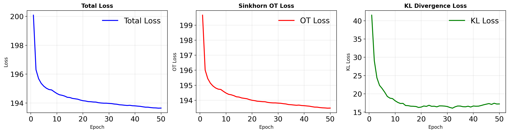 | 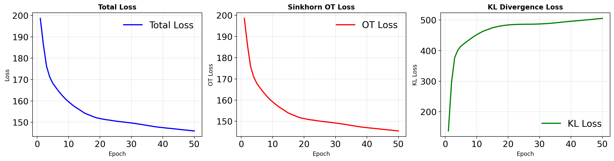 | 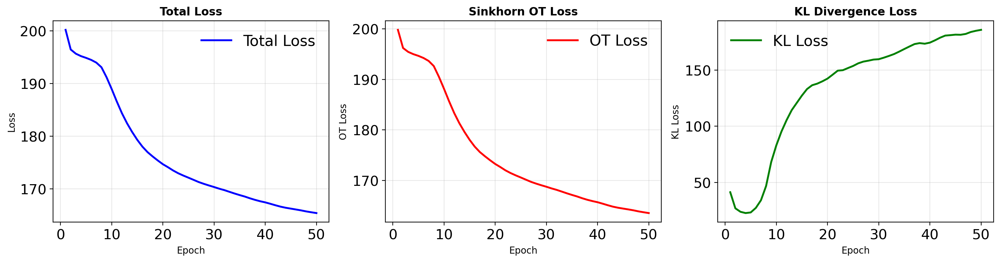 |

### Spatial Interpolation Results

Predicting cell populations at held-out timepoints (t=2):

| Latent 64 | Latent 128 | Latent 256 | Latent 512 | Latent 1024 |
|---|---|---|---|---|
| **t=0:** 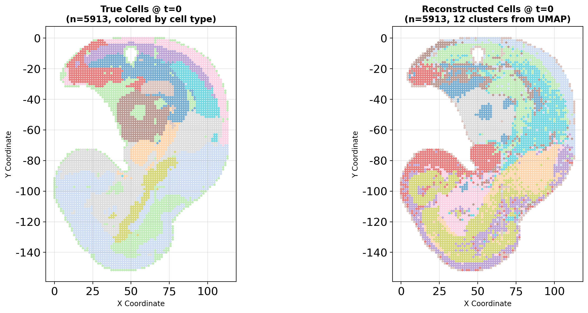 | **t=0:** 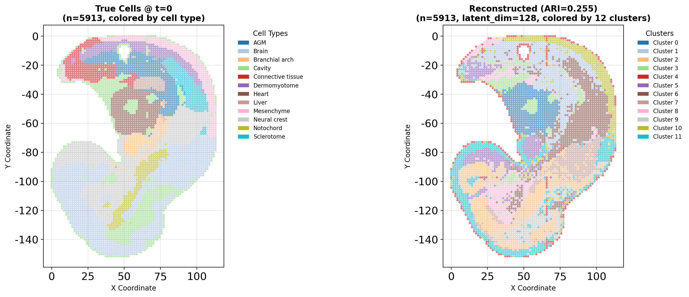 | **t=0:** 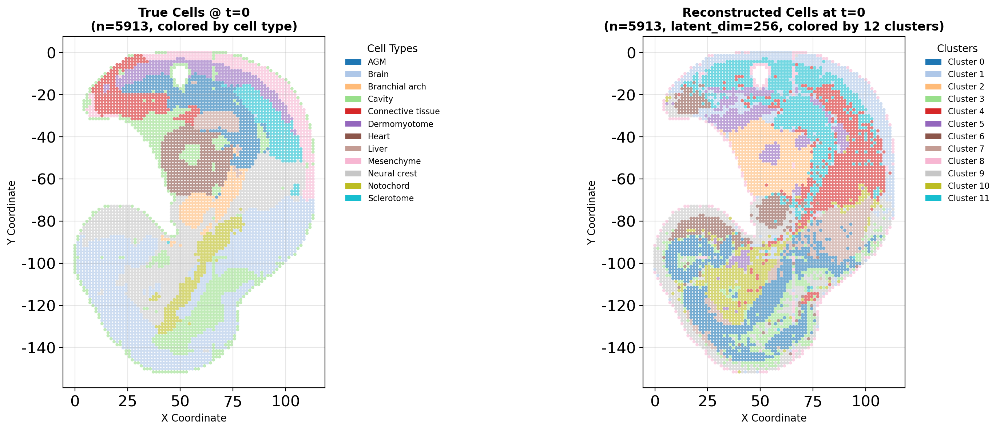 | **t=0:** 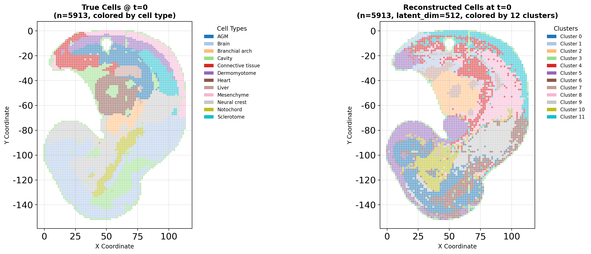 | **t=0:** 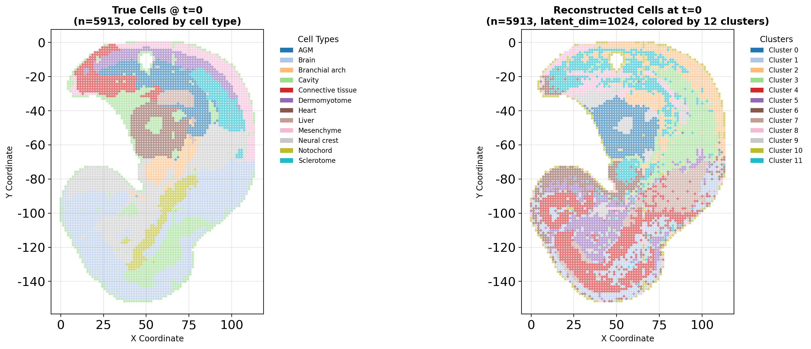 |
| **t=2 (pred):** 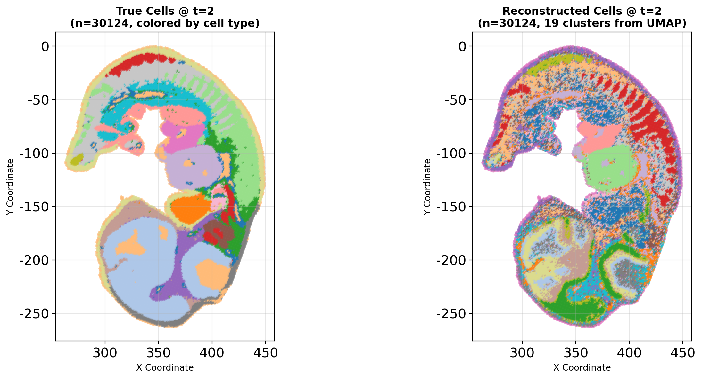 | **t=2 (pred):** 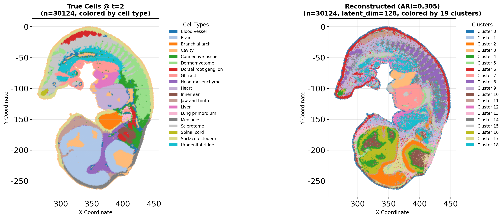 | **t=2 (pred):** 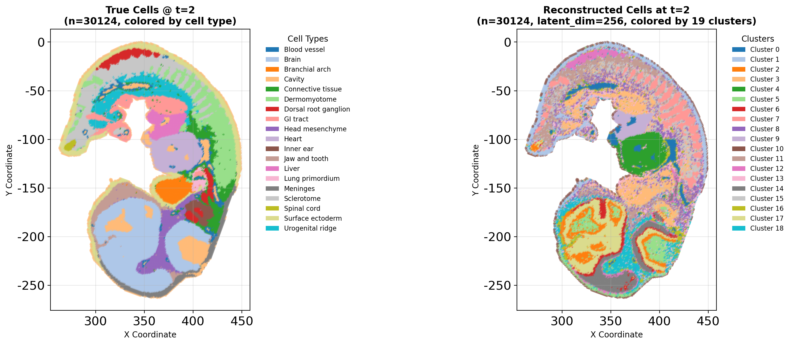 | **t=2 (pred):** 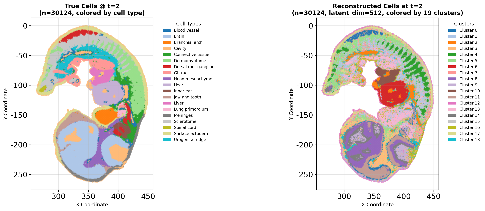 | **t=2 (pred):** 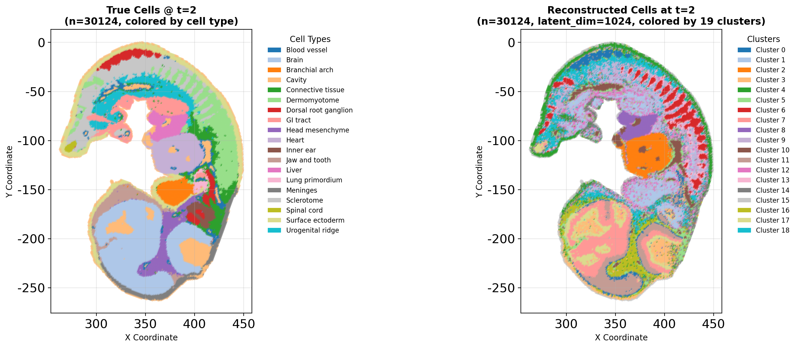 |

---

## 🏗️ Architecture

<div align="center">

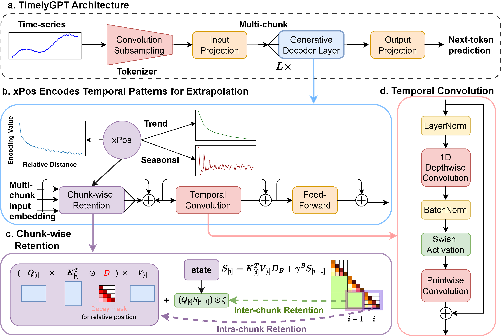

</div>

**TimelyGPT Pipeline**:
1. **VAE Encoder**: Gene expression (20K genes) → Latent code (64-1024D)
2. **RetNet Layers**: Temporal sequence modeling with exponential decay
3. **VAE Decoder**: Latent code → Gene expression reconstruction
4. **Loss**: Optimal transport (Sinkhorn) + latent trajectory smoothing

---

## 📁 Project Files

### Entry Points

| Script | Purpose | Status |
|--------|---------|--------|
| `5_SingleCell_TimelyGPT.py` | Main benchmark with TimelyGPT | ✅ Runs |
| `1_SingleCell_scNODE.py` | Neural ODE baseline | ✅ Full results |
| `scTimelyGPT.py` | Advanced spatiotemporal version | 🔧 Development |

### Core Modules

```
model/
  ├── TimelyGPT_CTS/       → Retention network blocks
  ├── scNODE/              → ODE solver + VAE baseline
  └── TrajGPT/             → Transformer alternative

optim/
  ├── running.py           → Training loop (scNODE reference)
  ├── loss_func.py         → MSE, Wasserstein (Sinkhorn)
  └── evaluation.py        → Metrics (L2, cosine, OT distance)

notebooks/
  ├── BenchmarkUtils.py    → Data loading & preprocessing
  ├── eval.py              → Standalone evaluation
  ├── pretrain.py          → VAE pre-training
  └── README.md            → Benchmark guide

plotting/
  ├── visualization.py     → UMAP, trajectory plots
  ├── PlottingUtils.py     → PCA/UMAP helpers
  └── __init__.py          → Color schemes
```

---

## 🔬 Supported Datasets

| Dataset | Cells | Timepoints | Tasks |
|---------|-------|-----------|-------|
| **Zebrafish (ZB)** | ~20K | 12 | Interpolation, forecasting, recovery |
| **Drosophila (DR)** | ~30K | 11 | Interpolation, forecasting, recovery |
| **Wot (SC)** | ~50K | 19 | Interpolation, forecasting, recovery |

Data: [Figshare](https://doi.org/10.6084/m9.figshare.25601610.v1)

---

## 🛠️ Key Features

✅ **VAE Pre-training**: Efficient dimensionality reduction  
✅ **Two-Phase Training**: VAE initialization + dynamic training  
✅ **Optimal Transport Loss**: Population-level distribution matching  
✅ **Multiple Architectures**: TimelyGPT, scNODE, TrajGPT baselines  
✅ **Comprehensive Evaluation**: L2, cosine, correlation, Wasserstein distance  
✅ **Visualization Tools**: UMAP embeddings, loss curves, trajectory plots  

---

## 💻 System Requirements

- **Python**: 3.7+
- **GPU**: NVIDIA GPU recommended (CUDA 11+)
- **Memory**: 16GB+ RAM for full datasets
- **Dependencies**: PyTorch 1.13+, scanpy, umap, geomloss

---

## 📚 Datasets & Models

### Getting Data
```bash
# Download from Figshare
wget https://figshare.com/ndownloader/files/...
tar -xzf data.tar.gz
# Place in: data/single_cell/experimental/{dataset}/
```

### Available Models

| Model | Type | Dynamics | Status |
|-------|------|----------|--------|
| **TimelyGPT** | Transformer | Retention Networks | ✅ Implemented |
| **scNODE** | ODE | Neural ODE | ✅ Reference baseline |
| **TrajGPT** | Transformer | Standard attention | ✅ Baseline |

---

## 🎓 Usage Example

```python
from notebooks.BenchmarkUtils import loadSCData, tpSplitInd
from optim.evaluation import globalEvaluation
from plotting.PlottingUtils import umapWithPCA

# Load data
ann_data, cell_tps, cell_types, n_genes, n_tps, all_tps = \
    loadSCData("zebrafish", "three_interpolation")

# Get train/test split
train_tps, test_tps = tpSplitInd("zebrafish", "three_interpolation")

# Evaluate predictions
metrics = globalEvaluation(true_data, predictions)
print(f"L2: {metrics['l2']:.4f}, OT: {metrics['ot']:.4f}")

# Visualize with UMAP
umap_emb, umap_model, pca_model = umapWithPCA(expression_data)
```

---

## 🔗 References

- **TimelyGPT/RetNet**: Sun et al., "Retentive Network for Sequence Modeling" (ICLR 2024)
- **Optimal Transport**: Cuturi, "Sinkhorn Distances: Lightspeed OT" (ICML 2013)
- **Neural ODE**: Chen et al., "Neural Ordinary Differential Equations" (NeurIPS 2018)
- **Benchmarks**: Established single-cell trajectory analysis methods (PRESCIENT, MIOFlow)

---

## 📧 Contact

**Author**: Jiaqi Zhang  
**Email**: jiaqi_zhang2@brown.edu  
**Lab**: Computational Biology

---

## 📄 License

MIT License — see [LICENSE](LICENSE)

---

**Status**: Active Research  
**Python**: 3.7+  
**PyTorch**: 1.13.1+  
**Last Updated**: 2026-07
